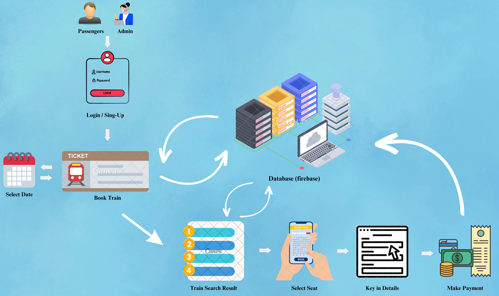

As part of my academic coursework, my teammate and I developed a Train Booking System using Visual Studio 2022. The system features four key modules: Admin, Passenger, Train Booking, and Payment. While the project was not fully completed, it strengthened my skills in application development, system design, and collaboration.

